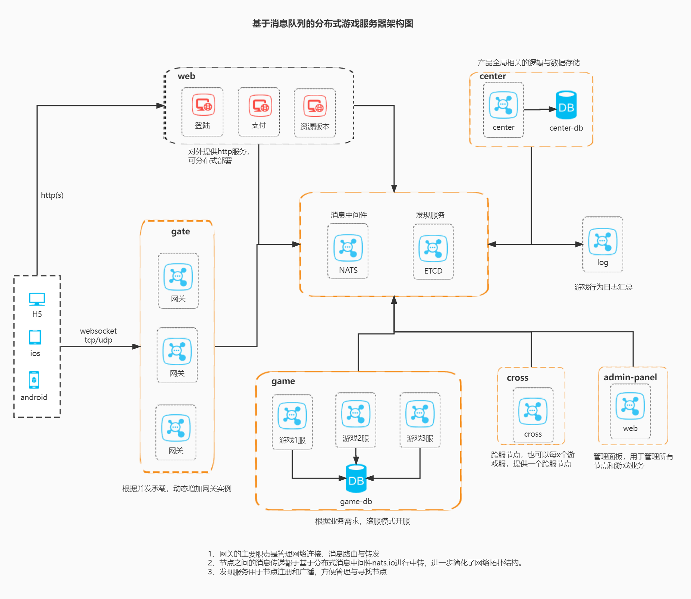

# 🍒 Cherry

[🌏 中文文档](README.md)


**High-performance, distributed Golang game server framework**

Built with Go + Actor Model, Cherry is designed for high performance and scalability. Simple to learn, so you can focus on game logic.

## 📦 Install

```bash
go get github.com/cherry-game/cherry
```

Requires Go 1.24+.

## 🚀 Quick Start

```go
package main

import (
    cherry "github.com/cherry-game/cherry"
)

func main() {
    app := cherry.Configure(
        "etc/profile/dev.json", // profile path
        "game-1",               // node ID
        true,                   // is frontend (accepts client connections)
        cherry.Cluster,         // cluster mode
    )
    app.Startup()
}
```

## 🗺️ Architecture



| Module | Path | Role |
|--------|------|------|
| App Assembly | `cherry.go` → `application.go` | Component registration, lifecycle, startup |
| Actor Execution | `net/actor/` | Per-Actor goroutine, serial mailbox, local/remote/event dispatch |
| Cluster Communication | `net/cluster/` + `net/nats/` + `net/discovery/` | Cross-node RPC, NATS transport, member discovery |
| Frontend Access | `net/parser/` + `net/connector/` | Protocol decode, session, agent Actor, WebSocket/TCP |

## 🌟 Core Features

### AppBuilder & Lifecycle

Chain components into a running server with a builder API:

```go
cherry.Configure("etc/profile/dev.json", "game-1", true, cherry.Cluster).
    Register(myComponent).
    SetSerializer(cherryFacade.NewProtobuf()).
    AddActors(myActor).
    Startup()
```

Lifecycle guarantees:

```
Register → Set → Init → OnAfterInit → (running) → OnBeforeStop → OnStop
```

Components stop in reverse registration order. Graceful shutdown via `SIGINT` / `SIGQUIT` / `SIGTERM`.

### Actor Model

Every Actor runs in its own goroutine with serial message processing. Three independent queues consumed in FIFO order:

| Queue | Source | Use Case |
|-------|--------|----------|
| **Local** | Client → Actor | Handle player requests |
| **Remote** | Actor → Actor (cross-node) | RPC between services |
| **Event** | System events | Decoupled notifications |

```go
type MyActor struct {
    capp.ActorLogger
}

func (p *MyActor) OnInit() {
    p.Local().Register("myHandler", p.handle)
    p.Remote().Register("myRemote", p.remote)
    p.EventRegister("eventName", p.onEvent)
}

func (p *MyActor) handle(session *cproto.Session, req *pb.MyReq) {
    p.Response(session, &pb.MyResp{Value: "ok"})
}
```

**Child Actors** — Actors can create child actors. Messages are routed through the parent. Children share the parent's lifecycle.

**Actor Timers** — Register timers and cron jobs directly on an Actor, guaranteed to execute on the Actor's goroutine.

### Cluster & Discovery

Three discovery backends, configurable via profile:

| Mode | Value | Scenario |
|------|-------|----------|
| `default` | Read from profile config | Single-process dev/test |
| `nats` | NATS master/worker heartbeat | Multi-node production |
| `etcd` | etcd lease + watch | Multi-node production (separate repo) |

```go
discovery := app.Discovery()

// Member queries
all := discovery.Map()
games := discovery.ListByType("game")
member, ok := discovery.Random("gate")

// Settings sync (auto-broadcasts to all nodes)
discovery.UpdateSetting("region", "us-east")

// Member change callbacks
discovery.OnAddMember(func(m IMember) {
    // new node joined
})
discovery.OnRemoveMember(func(m IMember) {
    // node left
})
```

Cross-node RPC via NATS, supporting sync/async patterns with configurable timeouts.

### Connectors & Protocols

Built-in connectors:

- **TCP** — raw socket
- **WebSocket** — browser clients
- **HTTP Server** — REST API
- **HTTP Client** — outbound requests

Two protocol formats:

| Protocol | Format | Use Case |
|----------|--------|----------|
| **Pomelo** | `type(1b) + length(3b) + data` | [pomelo](https://github.com/NetEase/pomelo) compatible clients |
| **Simple** | `id(4b) + dataLen(4b) + data` | Custom lightweight protocol |

### Message & Serialization

Zero-allocation message passing with object pooling:

```go
msg := cherryFacade.GetMessage()
msg.Source = "game-1.player-100"
msg.Target = "map-1.aoi"
msg.FuncName = "enter"
msg.Args = myPayload
```

- `sync.Pool` based message pool with reference counting
- **Protobuf** (default) and **JSON** serializers
- In-process messages skip serialization; cross-node messages auto-marshal via `ClusterPacket`

### Extend Library

21 utility packages included with the framework:

| Category | Packages |
|----------|----------|
| **Timing** | `time_wheel` (hierarchical timing wheels), `time` (helpers, offsets, travel) |
| **ID Gen** | `snowflake` (distributed unique IDs), `nuid` |
| **Data** | `compress` (zlib), `crypto` (MD5, CRC32, Base64), `gob`, `json` |
| **Collections** | `map`, `slice`, `queue`, `string` |
| **Infra** | `file`, `http/client`, `net`, `sync` (rate limiter) |
| **Reflect** | `reflect`, `mapstructure`, `regex` (cached) |
| **Encoding** | `base58` |

```go
// Time wheel — scheduler, timeouts, delayed execution
tw := cherryTimeWheel.NewTimeWheel(time.Millisecond*10, 20)
tw.AfterFunc(time.Second, func() { /* ... */ })

// Snowflake unique ID
node, _ := cherrySnowflake.NewNode(1)
id := node.Generate()
```

### Error Codes

Hierarchical error codes built into the framework:

```go
if code.IsFail(errCode) {
    p.ResponseCode(session, errCode)
    return
}
```

Predefined codes: `OK(0)`, session errors (`10+`), RPC errors (`20+`), Actor errors (`24+`).

### Logger

Built on [uber-go/zap](https://github.com/uber-go/zap):

- Structured logging with key-value pairs
- Multi-file output with rotation
- Configurable log levels and stack trace levels
- Console and file output simultaneously

## 🧰 Extension Components

### Available

| Component | Description |
|-----------|-------------|
| **data-config** | Game data table loading, multi-source, query helpers |
| **etcd** | etcd-based cluster discovery and service registry |
| **gin** | HTTP server with gin framework, middleware support |
| **gorm** | MySQL via gorm, multi-database config |
| **mongo** | MongoDB via mongo-driver, multi-database config |
| **cron** | Scheduled jobs via robfig/cron |

Repo: [cherry-game/components](https://github.com/cherry-game/components)

### Planned

DB write queue, gopher-lua scripting, rate limiter component, and more.

## 📖 Examples

### Single-node Chat Room

Great for beginners:

- Web-based client over WebSocket
- JSON communication
- Create rooms, send messages, broadcast

Source: [examples/demo_chat](https://github.com/cherry-game/examples/tree/master/demo_chat)

### Multi-node Distributed Game

Production-style reference:

- H5 client
- Web server, gateway, center, game server nodes
- Server list, multi-SDK auth, registration, login, character creation

Source: [examples/demo_cluster](https://github.com/cherry-game/examples/tree/master/demo_cluster)

## 🎮 Client SDKs

Clients compatible with the pomelo protocol work with Cherry.

| Platform | Libraries |
|----------|-----------|
| **Unity3D** | [YMoonRiver/Pomelo_UnityWebSocket](https://github.com/YMoonRiver/Pomelo_UnityWebSocket-2.7.0), [NetEase/pomelo-unityclient](https://github.com/NetEase/pomelo-unityclient) |
| **Cocos2d-x** | [NetEase/pomelo-cocos2dchat](https://github.com/NetEase/pomelo-cocos2dchat) |
| **JavaScript** | [pomelonode/pomelo-jsclient-websocket](https://github.com/pomelonode/pomelo-jsclient-websocket) |
| **C** | [topfreegames/libpitaya](https://github.com/topfreegames/libpitaya), [NetEase/libpomelo](https://github.com/NetEase/libpomelo/) |
| **iOS** | [NetEase/pomelo-iosclient](https://github.com/NetEase/pomelo-iosclient) |
| **Android / Java** | [NetEase/pomelo-androidclient](https://github.com/NetEase/pomelo-androidclient) |
| **WeChat** | [wangsijie/pomelo-weixin-client](https://github.com/wangsijie/pomelo-weixin-client) |

Protocol format: [pomelo protocol spec](https://github.com/NetEase/pomelo/wiki/%E5%8D%8F%E8%AE%AE%E6%A0%BC%E5%BC%8F)

## 📢 Updates

- Actor model implementation
- Simple packet format (`id(4b) + dataLen(4b) + data`)
- Examples moved to [examples](https://github.com/cherry-game/examples)
- Components moved to [components](https://github.com/cherry-game/components)
- Docs: [cherry-game.github.io](https://cherry-game.github.io/)

## 💬 Community

- QQ Group: [191651647](https://jq.qq.com/?_wv=1027&k=vdIddlK0)

## 🙏 Acknowledgments

- [pomelo](https://github.com/NetEase/pomelo) — original Node.js game server framework
- [pitaya](https://github.com/topfreegames/pitaya) — Go game server framework
