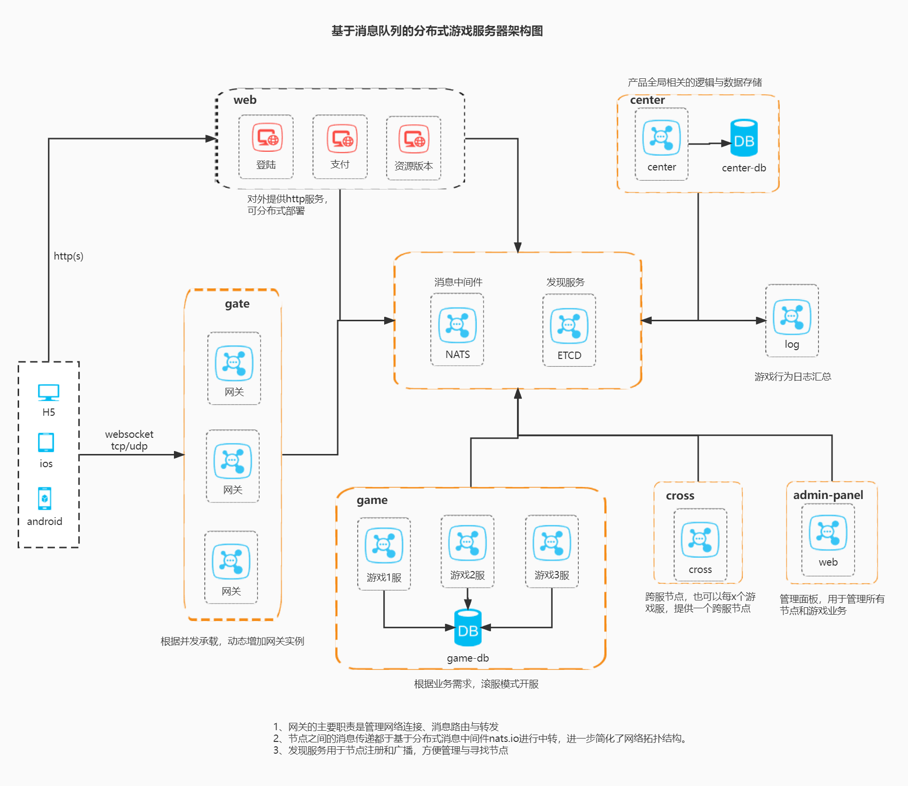

# 欢迎使用cherry!

- 这是一款分布式的golang游戏服务器框架
- 基于golang + nats.io + pomelo protocol技术构建
- 它具备高性能、可伸缩、分布式、协程分组管理等特点。并且上手简单、易学
- 让开发者更多的关注游戏业务，高效完成功能实现
- 文档陆续补充中，欢迎加入一起建设框架

# 新增功能
- **新增Actor model实现**
- **新增simple网络数据包结构(id(4bytes) + dataLen(4bytes) + data(n bytes))**

# 讨论与交流
- [QQ群讨论: 191651647 ](https://jq.qq.com/?_wv=1027&k=vdIddlK0)

# 教程

### 多节点精简版聊天室(❤推荐)
- 实现网页客户端，构建http server
- 选择websocket作为连接器
- 选择json做为通信格式
- 实现创建房间
- 实现发送消息
- 实现广播消息
- [示例代码跳转](examples/demo_chat)

### 多节点分布式游戏示例(❤强烈推荐)
- 选择h5搭建一个客户端
- 搭建web服节点
- 搭建网关服节点
- 搭建中心服节点
- 搭建游戏服节点
- 选择master做为发现服务节点
- 实现部份基础功能(区服列表、多sdk帐号体系、帐号注册、帐号登录、创建角色、角色登录)
- [示例代码跳转](examples/demo_game_cluster)

# 核心功能

### 组件管理
- 基于组件的方式组合功能，方便统一管理生命周期
- 可根据需求自定义组件，并注册到框架，灵活扩展
- 可配置`cluster mode`和`standalone mode`

### 环境配置
- 可配置多个环境的参数，方便切换
- 所有系统参数、组件参数都基于profile文件配置，方便扩展
- 可根据业务需求自由的拆分或组装多个profile子文件，精简配置,拒绝冗余

### actor模型
- 每个Actor独立运行在一个goroutine中，所有的逻辑都是串行处理
- Actor接收三种消息：本地消息(Local)、远程消息(Remote)、事件消息(Event)
  - 三种消息都有自己的队列(Queue)，每个队列依据FIFO原则进行消费
  - 本地消息(Local)，用于接收游戏客户端发送过来的本地消息
  - 远程消息(Remote)，用于Actor之间调用的远程消息
  - 事件消息(Event)，通过订阅/发布进行的事件消息
- Actor可以创建多个子Actor(ChildActor)，子Actor的消息由父Actor进行路由转发
- 通过cluster集群组件、discovery发现服务组件，进行跨节点的actor通信

### 集群&注册发现
- 三种发现服务实现方式:
    - 开发用，直接读取本地的节点配置文件
    - 小规模用，基于nats.io创建一个master节点，实现单节点的发现服务
    - 线上用，基于etcd封装，实现集群方式的发现服务
- 基于nats.io实现的RPC调用，默认提供同步/异步的调用方式

### 连接器
- tcp
- websocket
- http server
- http client
- kcp(未实现，以后作为组件集成)

### 消息&路由
- 实现pomelo网络数据包结构 & simple网络数据包结构
- 包解码&编码
- 消息路由
- 消息序列化(自带json/protobuf)
- 事件

### 日志
- 基于`uber zap`封装，性能良好
- 可配置多文件进行日志输出
- 基于`rotatelogs`处理切割日志

# 扩展组件

### [data-config组件](components/data-config)
- 策划配表读取管理组件
- 可基于本地配置文件的方式加载
- 可基于redis数据的方式加载
- 可基于接口抽像自定义数据源加载
- 支持自定义文件格式读取，目前已实现`JSON`格式读取
- 支持缓存热更新
- 可自定义类型检测
- 可根据`go-linq`进行数据集合的条件查询

### [etcd组件](components/etcd)
- 基于`etcd`组件进行封装，节点集群和注册发现

### [gin组件](components/gin)
- 集成`gin`组件，实现http server功能
- 自定义`controller`，增加`PreInit()`、`Init()`、`Stop()`初始周期的管理
- 增加几个常用的`middleware`组件
    - gin zap
    - recover with zap
    - cors跨域
    - max connect限流
- 封装了GET/POST方式获取各种数据类型的函数

### [gorm组件](components/gorm)
- 集成`gorm`组件，实现mysql的数据库访问
- 支持多个mysql数据库配置和管理

### [mongo组件](components/mongo)
- 集成`mongo-driver`驱动
- 支持多个mongodb数据库配置和管理

### [cron组件](components/cron)
- 基于`github.com/robfig/cron/v3`进行封装成组件
- 性能良好

### 待开放组件
- db队列
- gopher-lua脚本
- 限流组件

# 游戏客户端SDK

- 通信协议格式
  - 通信协议结构图 [点击查看](_docs/pomelo-protocol.jpg)
  - pomelo wiki介绍的协议格式 [点击查看](https://github.com/NetEase/pomelo/wiki/%E5%8D%8F%E8%AE%AE%E6%A0%BC%E5%BC%8F)

- unity3d
  - [YMoonRiver/Pomelo_UnityWebSocket](https://github.com/YMoonRiver/Pomelo_UnityWebSocket-2.7.0)
  - [NetEase/pomelo-unityclient](https://github.com/NetEase/pomelo-unityclient)
  - [NetEase/pomelo-unityclient-socket](https://github.com/NetEase/pomelo-unityclient-socket)

- cocos2dx
  - [NetEase/pomelo-cocos2dchat](https://github.com/NetEase/pomelo-cocos2dchat)

- Javascript
  - [pomelonode/pomelo-jsclient-websocket](https://github.com/pomelonode/pomelo-jsclient-websocket)
  - [pomelonode/pomelo-jsclient-socket.io](https://github.com/pomelonode/pomelo-jsclient-socket.io)

- C
  - [**topfreegames/libpitaya**](https://github.com/topfreegames/libpitaya)
  - [NetEase/libpomelo](https://github.com/NetEase/libpomelo/)

- iOS
  - [NetEase/pomelo-iosclient](https://github.com/NetEase/pomelo-iosclient)
  - [ETiV/PomeloClient-iOS-WebSocket](https://github.com/ETiV/PomeloClient-iOS-WebSocket)
  - [GeforceLee/Websocket-Pomelo](https://github.com/GeforceLee/Websocket-Pomelo)

- Android & Java
  - [NetEase/pomelo-androidclient](https://github.com/NetEase/pomelo-androidclient)
  - [jzsues/pomelo-websocket-java-client](https://github.com/jzsues/pomelo-websocket-java-client)

- 微信
  - [wangsijie / pomelo-weixin-client](https://github.com/wangsijie/pomelo-weixin-client)

# 游戏服务端架构示例(点击看大图)

# 致谢

- [pomelo](https://github.com/NetEase/pomelo)
- [pitaya](https://github.com/topfreegames/pitaya)
